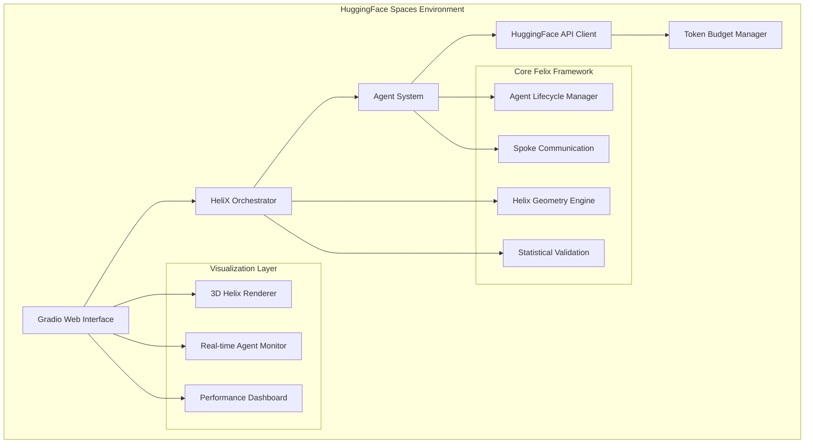

# Felix Framework - HuggingFace Spaces Deployment Architecture

## Overview

This document outlines the comprehensive architecture for deploying the Felix Framework to HuggingFace Spaces, maintaining research integrity while providing an accessible web interface for helix-based multi-agent cognitive architecture.

## System Architecture

### 1. Core Components Integration

### 2. Component Specifications

#### HuggingFaceClient Integration
- **Purpose**: Replace LM Studio client with HF API integration
- **Key Features**:
  - Multi-model support using HF inference API
  - Token budget management with rate limiting
  - Error handling for API failures
  - Model switching based on agent specialization
  - Async processing for concurrent agents

#### Gradio Web Interface
- **Purpose**: Educational and interactive web interface
- **Key Features**:
  - Real-time helix visualization
  - Agent spawning controls
  - Task input and result display
  - Performance monitoring dashboard
  - Export and sharing capabilities

#### 3D Helix Visualization
- **Purpose**: Browser-compatible helix rendering
- **Key Features**:
  - WebGL-based 3D rendering
  - Real-time agent position updates
  - Interactive camera controls
  - Mathematical precision indicators
  - Educational annotations

### 3. Resource Management

#### Memory Constraints
- **HF Spaces Limits**: ~16GB RAM typical
- **Felix Requirements**: ~1.2GB for 133 agents (validated)
- **Optimization Strategy**:
  - Lazy agent initialization
  - Progressive result caching
  - Memory-efficient helix calculations

#### Processing Constraints
- **HF API Rate Limits**: Model-dependent
- **Concurrent Processing**: Limited by token budget
- **Optimization Strategy**:
  - Intelligent agent batching
  - Priority-based processing
  - Graceful degradation

#### Storage Constraints
- **Persistent Storage**: Limited in HF Spaces
- **Data Strategy**:
  - In-memory results with export options
  - Cached helix calculations
  - Session-based state management

### 4. Performance Optimization

#### Agent Coordination Efficiency
- **Spoke Communication**: Maintained O(N) complexity
- **Batch Processing**: Group similar agents
- **Progressive Results**: Stream outputs as available
- **Caching Strategy**: Pre-compute helix positions

#### API Efficiency
- **Model Selection**: Match agent type to optimal model
- **Token Management**: Predictive budget allocation
- **Request Batching**: Minimize API calls
- **Fallback Handling**: Graceful degradation paths

### 5. Educational Value Preservation

#### Research Integrity
- **Mathematical Precision**: <1e-12 error tolerance maintained
- **Statistical Frameworks**: All validation tools accessible
- **Hypothesis Testing**: Interactive validation demos
- **Performance Benchmarks**: Real-time comparison displays

#### User Experience
- **Guided Tours**: Step-by-step helix exploration
- **Interactive Demos**: Live agent coordination examples
- **Export Capabilities**: Results, visualizations, configurations
- **Mobile Responsive**: Accessible across devices

## Implementation Phases

### Phase 1: Foundation (Core Integration)
1. **HuggingFaceClient** - API integration with token management
2. **Basic Gradio Interface** - Simple interaction and visualization
3. **Mathematical Validation** - Precision preservation testing
4. **Agent System Adaptation** - Cloud environment compatibility

### Phase 2: Visualization (3D Interface)
1. **WebGL Helix Renderer** - Browser-compatible 3D visualization
2. **Real-time Updates** - Agent position and state monitoring
3. **Interactive Controls** - Camera, zoom, agent selection
4. **Performance Dashboard** - System metrics and statistics

### Phase 3: Advanced Features (Full Experience)
1. **Multi-model Configuration** - Advanced agent specialization
2. **Export and Sharing** - Results and configuration sharing
3. **Educational Content** - Guided tours and explanations
4. **Mobile Optimization** - Responsive design refinement

### Phase 4: Production Optimization
1. **Performance Tuning** - Resource usage optimization
2. **Error Handling** - Comprehensive failure management
3. **User Analytics** - Usage patterns and optimization
4. **Documentation** - Complete user and developer guides

## Integration Checklist

### Core System Validation
- [ ] Mathematical precision preserved (<1e-12 error)
- [ ] Agent lifecycle management functional
- [ ] Spoke communication system working
- [ ] Statistical validation frameworks accessible
- [ ] Multi-agent coordination effective

### HuggingFace Integration
- [ ] API client functional with rate limiting
- [ ] Token budget management working
- [ ] Multi-model support implemented
- [ ] Error handling comprehensive
- [ ] Performance monitoring active

### Web Interface Quality
- [ ] Gradio interface intuitive and responsive
- [ ] 3D visualization accurate and smooth
- [ ] Real-time updates working properly
- [ ] Export and sharing functional
- [ ] Mobile compatibility verified

### Research Value Maintenance
- [ ] Educational content accurate and engaging
- [ ] Scientific methodology preserved
- [ ] Performance comparisons valid
- [ ] Statistical results accessible
- [ ] Mathematical foundations clear

## Success Metrics

### Technical Performance
- **Response Time**: <2 seconds for agent spawning
- **Visualization FPS**: >30 FPS for smooth interaction
- **Memory Usage**: <12GB for full system
- **Error Rate**: <1% for API interactions
- **Uptime**: >99% availability

### User Experience
- **Load Time**: <5 seconds initial page load
- **Interaction Latency**: <500ms for user actions
- **Mobile Performance**: Fully functional on mobile devices
- **Accessibility**: WCAG 2.1 AA compliance
- **Educational Value**: Clear scientific presentation

### Research Integrity
- **Mathematical Accuracy**: All calculations within error tolerance
- **Statistical Validity**: Proper hypothesis testing and validation
- **Performance Claims**: Accurately represented benchmark results
- **Reproducibility**: Consistent results across sessions
- **Scientific Communication**: Clear explanation of methods and results

## Risk Mitigation

### Technical Risks
- **API Rate Limiting**: Token budget management and batching
- **Memory Constraints**: Lazy loading and efficient algorithms
- **Performance Issues**: Progressive optimization and caching
- **Browser Compatibility**: Cross-platform testing and fallbacks

### Research Integrity Risks
- **Precision Loss**: Comprehensive validation testing
- **Methodology Changes**: Clear documentation of adaptations
- **Performance Misrepresentation**: Accurate benchmark presentations
- **Educational Accuracy**: Scientific review of content

## Deployment Strategy

### Development Environment
- **Local Testing**: Full Felix Framework validation
- **Cloud Testing**: HuggingFace Spaces compatibility
- **Performance Testing**: Resource constraint validation
- **User Testing**: Interface usability validation

### Production Deployment
- **Gradual Rollout**: Feature-by-feature deployment
- **Monitoring**: Performance and error tracking
- **User Feedback**: Continuous improvement based on usage
- **Documentation**: Complete user and developer guides

This architecture ensures that the Felix Framework maintains its research integrity and educational value while becoming accessible through a modern web interface, demonstrating the advantages of helix-based multi-agent coordination to a broader audience.